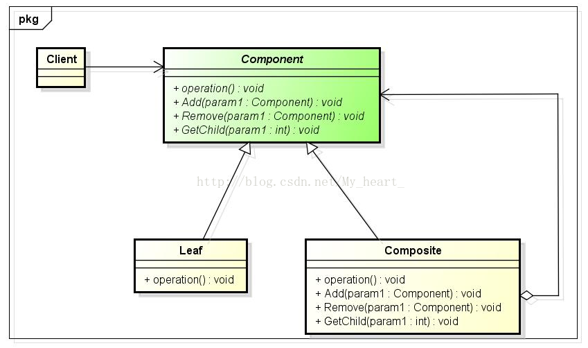

# Composite

## 动机(Motivation)
+ 客户代码过多地依赖于对象容器复杂的内部实现结构，对象容器内部实现结构(而非抽象结构)的变化
引起客户代码的频繁变化，带来了代码的维护性、扩展性等弊端。
+ 如何将”客户代码与复杂的对象容器结构“解耦？让对象容器自己来实现自身的复杂结构，从而使得客户代码就像处理简单对象一样来处理复杂的对象容器？

## 模式定义
将对象组合成树形结构以表示”部分-整体“的层次结构。Composite使得用户对单个对象和组合对象的使用具有一致性(稳定)。
——《设计模式》GoF

## 要点总结
+ Composite模式采用树性结构来实现普遍存在的对象容器，从而将”一对多“的关系转化为”一对一“的关系，使得客户代码可以一致地(复用)处理对象和对象容器，
无需关心处理的是单个的对象，还是组合的对象容器。
+ 客户代码与纯粹的抽象接口——而非对象容器的内部实现结构——发生依赖，从而更能”应对变化“。
+ Composite模式在具体实现中，可以让父对象中的子对象反向追溯；如果父对象有频繁的遍历需求，可使用缓存技术来改善效率。

## 结构

 

Component：
1. 为组合中的对象声明接口；
2. 在适当的情况下，实现所有类共有接口的缺省行为；
3. 声明一个接口用于访问和管理Component的子组件。

Leaf：
1. 在组合中表示叶节点对象，叶节点没有子节点；
2. 在组合中定义叶节点的行为。
   
Composite：
1. 定义有子部件的那些部件的行为；
2. 存储子部件。
   
Client：
1. 通过Component接口操作组合部件的对象。

## 场景

用于层次结构的表达，除叶子节点外，每个非叶子节点存储了若干子节点
