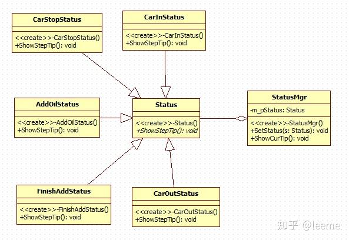

# State

## 动机(Motivation)
+ 对象状态如果改变，其行为也会随之而发生变化，比如文档处于只读状态，其支持的行为和读写状态支持的行为就可能完全不同。
+ 如何在运行时根据对象的状态来透明地改变对象的行为？

## 模式定义
允许一个对象在其内部状态改变时改变它的行为。从而使对象看起来似乎修改了其行为。
——《设计模式》GoF

## 要点总结
+ State模式将所有与一个特定状态相关的行为都放入一个State的子对象中，在对象状态切换时，切换相应的对象；
但同时维持State的接口，这样实现了具体操作与状态转换之间的解耦。
+ 转换是原子性的
+ 与Strategy模式类似

## 结构

