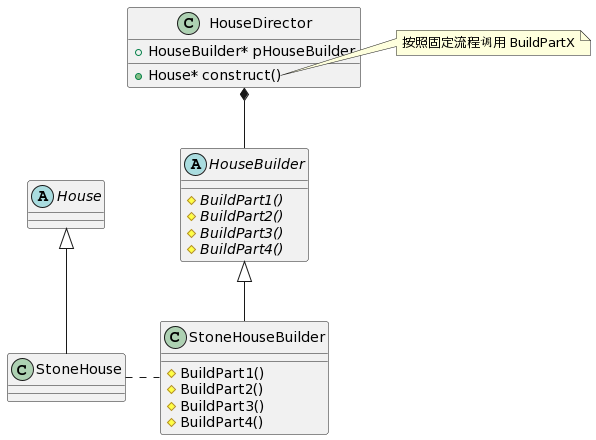

# Builder

## 动机（Motivation）
+ 在软件系统中，有时候面临着“一个复杂对象”的创建工作，其通常由各个部分的子对象用一定的算法构成；由于需求的变化，这
个复杂对象的各个部分经常面临着剧烈的变化，但是将它们组合在一起的算法却相对稳定。
+ 如何应对这种变化？如何提供一种“封装机制”来隔离出“复杂对象的各个部分”的变化，从而保持系统中的“稳定构建算法”不随着需求改变而改变？

## 模式定义
将一个复杂对象的构建与其表示相分离，使得同样的构建过程(稳定)可以创建不同的表示(变化)。
——《设计模式》GoF

## 要点总结
+ Builder 模式主要用于“分步骤构建一个复杂的对象”。在这其中“分步骤”是一个稳定的算法，而复杂对象的各个部分则经常变化。
+ 变化点在哪里，封装哪里—— Builder模式主要在于应对“复杂对象各个部分”的频繁需求变动。其缺点在于难以应对“分步骤构建算法”的需求变动。
+ 在Builder模式中，要注意不同语言中构造器内调用虚函数的差别（C++(构造函数中不可以调用虚函数) vs. C#)。

## 类图

如果需要加新的House类型，需要创建对应的Builder，实现内部的各部分算法，其他不需要修改

符合开闭原则，依赖倒置原则