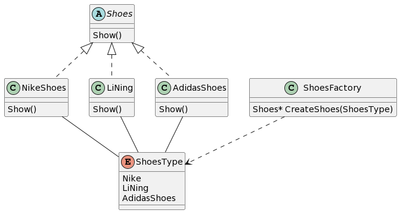
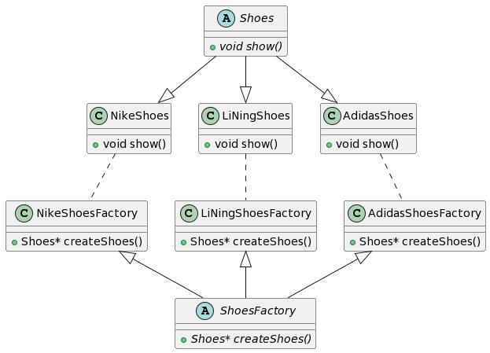
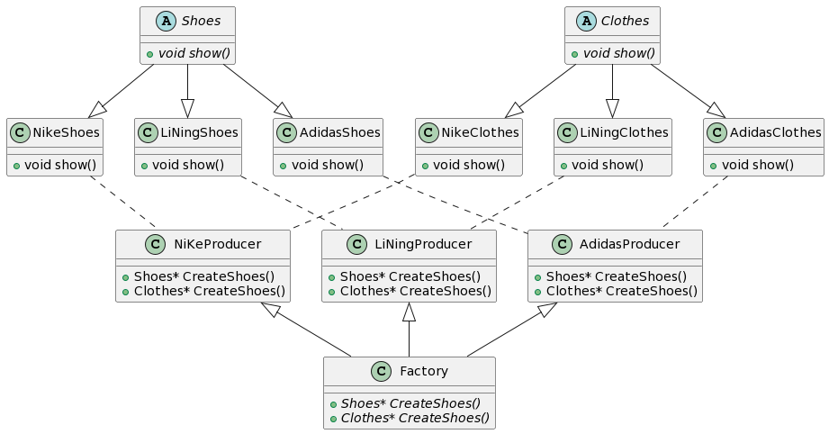

# Factory Method

## 动机（Motivation）
+ 在软件系统中，经常面临着创建对象的工作；由于需求的变化，需要创建的对象的具体类型经常变化。
+ 如何应对这种变化？如何绕过常规的对象创建方法(new)，提供一种“封装机制”来避免客户程序和这种“具体对象创建工作”的紧耦合？

## 模式定义
定义一个用于创建对象的接口，让子类决定实例化哪一个类。Factory Method使得一个类的实例化延迟（目的：解耦，手段：虚函数）到子类。
——《设计模式》GoF

## 要点总结
+ Factory Method模式用于隔离类对象的使用者和具体类型之间的耦合关系。面对一个经常变化的具体类型，紧耦合关系(new)会导致软件的脆弱。
+ Factory Method模式通过面向对象的手法，将所要创建的具体对象工作延迟到子类，从而实现一种扩展（而非更改）的策略，较好地解决了这种紧耦合关系。
+ Factory Method模式解决“单个对象”的需求变化。缺点在于要求创建方法/参数相同。

## example

### 简单工厂模式

代码见 factory1.cpp

工厂类封装了创建具体产品对象的函数,抽象类的实现通过统一的接口进行对象的创建

扩展性非常差，新增产品的时候，需要去修改工厂类，不满足开闭原则

### 工厂方法模式

代码见 factory2.cpp

### 抽象工厂类

不是为每件产品创建一个工厂，而是为一个品牌下的所有产品创建工厂

工厂能够创建相关的一系列对象，如一个品牌下的衣服、鞋子等

工厂方法模式与抽象工厂类 具有低耦合易于拓展的特点