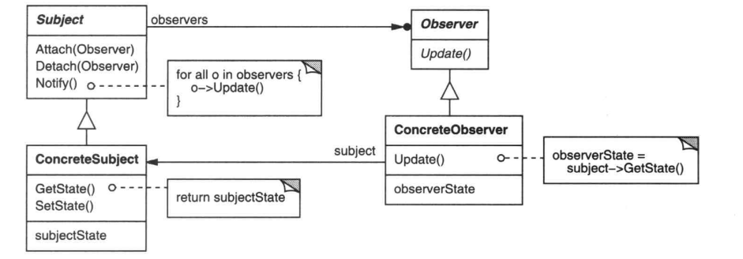

## 意图
定义对象间的一种一对多的依赖关系，当一个对象的状态发生改变时，所有依赖于它的对象都得到通知并被自动更新。

## 动机
将一个系统设计成一系列相互协作的类有一个常见的副作用：需要维护相关对象之间的一致性。

观察者模式定义一种交互，即**发布-订阅**：

一个对象当自身状态发生改变时，会发出通知，但是并不知道谁是他的接收者，但每个接收者都会接收到通知，这些接受者称为观察者。
作为对通知的响应，每个观察者都将查询目标状态，然后改变自身的状态以和目标状态进行同步。

## 使用场景：
使对象封装为独立的改变和使用；
一个对象改变同时需要改变其它对象，而不知道具体有多少对象需要改变；
不希望对象是紧耦合的。
## 结构

## 参与者
Subject：目标，知道它的观察者，提供注册和删除观察者对象的接口

Observer：观察者，为那些在目标发生改变时需获得通知的对象定义一个更新接口

ConcreteSubject：具体目标，存储对象状态，状态改变时，向各个观察者发出通知

ConcreteObserver：具体观察者，维护一个指向ConcreteSubject对象的引用，存储有关状态，实现更新接口update，使自身状态与目标的状态保持一致

## 优缺点

1. 目标和观察者之间松耦合

2. 支持广播通信：Subject发送的通知不需要指定它的接受者。通知被自动广播给所有已向该目标对象登记的有关对象。

3. 意外的更新：看似无害的操作可能会引起观察者错误的更新。