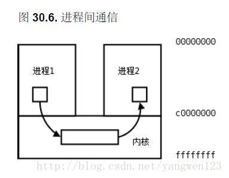
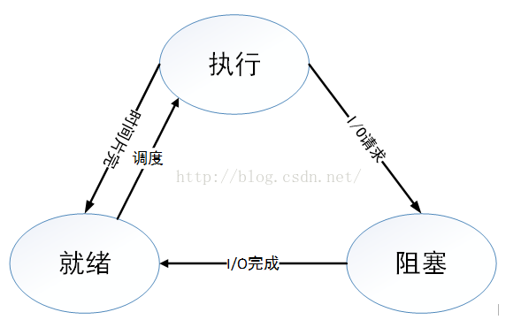
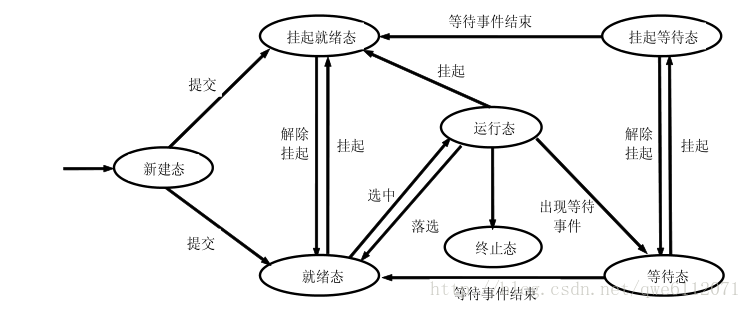

# 操作系统
#### （1） 进程与线程的区别和联系（重点）
* 区别
1. 进程是对运行时程序的封装，是系统进行资源分配和调度的基本单元，而线程是进程的子任务，是CPU分配和调度的基本单元。
2. 一个进程可以有多个线程，但是一个线程只能属于一个进程。
3. 进程的创建需要系统分配内存和CPU，文件句柄等资源，销毁时也要进行相应的回收，所以进程的管理开销很大；但是线程的管理开销则很小。
4. 进程之间不会相互影响；而一个线程崩溃会导致进程崩溃，从而影响同个进程里面的其他线程。

* 联系 进程与线程之间的关系：线程是存在进程的内部，一个进程中可以有多个线程，一个线程只能存在一个进程中。
#### （2） Linux理论上最多可以创建多少个进程？一个进程可以创建多少线程，和什么有关
答：32768. 因为进程的pid是用pid_t来表示的，pid_t的最大值是32768.所以理论上最多有32768个进程。

至于线程。进程最多可以创建的线程数是根据分配给调用栈的大小，以及操作系统（32位和64位不同）共同决定的。Linux32位下是300多个。
#### （3） 冯诺依曼结构有哪几个模块？分别对应现代计算机的哪几个部分？（百度安全一面）
* 存储器：内存
* 控制器：南桥北桥
* 运算器：CPU
* 输入设备：键盘
* 输出设备：显示器、网卡
#### （4） 进程之间的通信方法有哪几种 （重点）
进程之间的通信方式主要有六种，包括**管道，信号量，消息队列，信号，共享内存，套接字**。

* 管道：管道是半双工的，双方需要通信的时候，需要建立两个管道。管道的实质是一个内核缓冲区，进程以先进先出的方式从缓冲区存取数据：管道一端的进程顺序地将进程数据写入缓冲区，另一端的进程则顺序地读取数据，该缓冲区可以看做一个循环队列，读和写的位置都是自动增加的，一个数据只能被读一次，读出以后再缓冲区都不复存在了。当缓冲区读空或者写满时，有一定的规则控制相应的读进程或写进程是否进入等待队列，当空的缓冲区有新数据写入或慢的缓冲区有数据读出时，就唤醒等待队列中的进程继续读写。管道是最容易实现的


  匿名管道pipe和命名管道除了建立，打开，删除的方式不同外，其余都是一样的。匿名管道只允许有亲缘关系的进程之间通信，也就是父子进程之间的通信，命名管道允许具有非亲缘关系的进程间通信。

  管道的底层实现 https://segmentfault.com/a/1190000009528245

* 信号量：信号量是一个计数器，可以用来控制多个进程对共享资源的访问。信号量只有等待和发送两种操作。等待(P(sv))就是将其值减一或者挂起进程，发送(V(sv))就是将其值加一或者将进程恢复运行。

* 信号：信号是Linux系统中用于进程之间通信或操作的一种机制，信号可以在任何时候发送给某一进程，而无须知道该进程的状态。如果该进程并未处于执行状态，则该信号就由内核保存起来，知道该进程恢复执行并传递给他为止。如果一个信号被进程设置为阻塞，则该信号的传递被延迟，直到其阻塞被取消时才被传递给进程。 信号是开销最小的

* 共享内存：共享内存允许两个或多个进程共享一个给定的存储区，这一段存储区可以被两个或两个以上的进程映射至自身的地址空间中，就像由malloc()分配的内存一样使用。一个进程写入共享内存的信息，可以被其他使用这个共享内存的进程，通过一个简单的内存读取读出，从而实现了进程间的通信。共享内存的效率最高，缺点是没有提供同步机制，需要使用锁等其他机制进行同步。

* 消息队列：消息队列就是一个消息的链表，是一系列保存在内核中消息的列表。用户进程可以向消息队列添加消息，也可以向消息队列读取消息。
消息队列与管道通信相比，其优势是对每个消息指定特定的消息类型，接收的时候不需要按照队列次序，而是可以根据自定义条件接收特定类型的消息。
可以把消息看做一个记录，具有特定的格式以及特定的优先级。对消息队列有写权限的进程可以向消息队列中按照一定的规则添加新消息，对消息队列有读权限的进程可以从消息队列中读取消息。

* 套接字：套接口也是一种进程间通信机制，与其他通信机制不同的是，它可用于不同设备及其间的进程通信。
#### （5） 进程调度方法详细介绍
https://blog.csdn.net/u011080472/article/details/51217754

https://blog.csdn.net/leex_brave/article/details/51638300

* 先来先服务 （FCFS first come first serve）：按照作业到达任务队列的顺序调度  FCFS是非抢占式的，易于实现，效率不高，性能不好，有利于长作业（CPU繁忙性）而不利于短作业（I/O繁忙性）。
* 短作业优先 （SHF short job first）：每次从队列里选择预计时间最短的作业运行。SJF是非抢占式的，优先照顾短作业，具有很好的性能，降低平均等待时间，提高吞吐量。但是不利于长作业，长作业可能一直处于等待状态，出现饥饿现象；完全未考虑作业的优先紧迫程度，不能用于实时系统。
* 最短剩余时间优先 该算法首先按照作业的服务时间挑选最短的作业运行，在该作业运行期间，一旦有新作业到达系统，并且该新作业的服务时间比当前运行作业的剩余服务时间短，则发生抢占；否则，当前作业继续运行。该算法确保一旦新的短作业或短进程进入系统，能够很快得到处理。
* 高响应比优先调度算法（Highest Reponse Ratio First, HRRF）是非抢占式的，主要用于作业调度。基本思想：每次进行作业调度时，先计算后备作业队列中每个作业的响应比，挑选最高的作业投入系统运行。响应比 = （等待时间 + 服务时间） / 服务时间 = 等待时间 / 服务时间 + 1。因为每次都需要计算响应比，所以比较耗费系统资源。
* 时间片轮转 用于分时系统的进程调度。基本思想：系统将CPU处理时间划分为若干个时间片（q），进程按照到达先后顺序排列。每次调度选择队首的进程，执行完1个时间片q后，计时器发出时钟中断请求，该进程移至队尾。以后每次调度都是如此。该算法能在给定的时间内响应所有用户的而请求，达到分时系统的目的。
* 多级反馈队列(Multilevel Feedback Queue)
#### （6） 进程的执行过程是什么样的，执行一个进程需要做哪些工作？
进程的执行需要经过三大步骤：编译，链接和装入。
* 编译：将源代码编译成若干模块
* 链接：将编译后的模块和所需要的库函数进行链接。链接包括三种形式：静态链接，装入时动态链接（将编译后的模块在链接时一边链接一边装入），运行时动态链接（在执行时才把需要的模块进行链接）
* 装入：将模块装入内存运行

https://blog.csdn.net/qq_38623623/article/details/78306498

将进程装入内存时，通常使用分页技术，将内存分成固定大小的页，进程分为固定大小的块，加载时将进程的块装入页中，并使用页表记录。减少外部碎片。

通常操作系统还会使用虚拟内存的技术将磁盘作为内存的扩充。
#### （6） 操作系统的内存管理说一下
https://www.cnblogs.com/peterYong/p/6556619.html

https://zhuanlan.zhihu.com/p/141602175

操作系统的内存管理包括物理内存管理和虚拟内存管理
* 物理内存管理包括交换与覆盖，分页管理，分段管理和段页式管理等；
* 虚拟内存管理包括虚拟内存的概念，页面置换算法，页面分配策略等；

（面试官这样问的时候，其实是希望你能讲讲虚拟内存）
#### （7） 实现一个LRU算法
用到两个数据结构：哈希+双向链表
```
unordered_map<int,list<pair<int,int> > > cache ;// 存放键，迭代器
list<pair<int,int>> auxlist; // 存放 <键，值>
```
```
class LRUCache {
    int cap;
    list<pair<int,int>> l;// front:new back:old 存放值 新的放前面，因为前面的可以取得有效的迭代器
    map<int,list<pair<int,int> >::iterator > cache;// 存放键，迭代器
public:
    LRUCache(int capacity) {
        cap=capacity;
    }

    int get(int key) {
        auto mapitera = cache.find(key);
        if(mapitera==cache.end()){
            return -1;
        }else{// found
            list<pair<int,int>>::iterator listItera = mapitera->second;
            int value = (*listItera).second;

            l.erase(listItera);
            l.push_front({key,value});
            cache[key]=l.begin();

            return value;
        }
    }

    void put(int key, int value) {
        auto itera = cache.find(key);
        if(itera!=cache.end()){// exist
            list<pair<int,int>>::iterator listItera = itera->second;

            l.erase(listItera);
            l.push_front({key,value});
            cache[key]=l.begin();

        }else{// not exist
            if(cache.size()>=cap){
                pair<int,int> oldpair = l.back();
                l.pop_back();
                cache.erase(oldpair.first);
            }
            l.push_front({key,value});
            cache[key]=l.begin();
        }
    }
};

/**
 * Your LRUCache object will be instantiated and called as such:
 * LRUCache* obj = new LRUCache(capacity);
 * int param_1 = obj->get(key);
 * obj->put(key,value);
 */
```
#### （8） 死锁产生的必要条件（怎么检测死锁，解决死锁问题）
（1） 互斥：一个资源每次只能被一个进程使用。<br>
（2） 占有并请求：一个进程因请求资源而阻塞时，对已获得的资源保持不放。<br>
（3） 不可剥夺:进程已获得的资源，在末使用完之前，不能强行剥夺。<br>
（4） 循环等待:若干进程之间形成一种头尾相接的循环等待资源关系。<br>

产生死锁的原因主要是：<br>
（1） 因为系统资源不足。<br>
（2） 进程运行推进的顺序不合适。<br>
（3） 资源分配不当等。<br>
#### （8） 死锁的恢复
1. 重新启动：是最简单、最常用的死锁消除方法，但代价很大，因为在此之前所有进程已经完成的计算工作都将付之东流，不仅包括死锁的全部进程，也包括未参与死锁的全部进程。
2. 终止进程(process termination)：终止参与死锁的进程并回收它们所占资源。
    (1) 一次性全部终止；(2) 逐步终止(优先级，代价函数)
3. 剥夺资源(resource preemption):剥夺死锁进程所占有的全部或者部分资源。
    (1) 逐步剥夺：一次剥夺死锁进程所占有的一个或一组资源，如果死锁尚未解除再继续剥夺，直至死锁解除为止。
    (2) 一次剥夺：一次性地剥夺死锁进程所占有的全部资源。
4. 进程回退(rollback):让参与死锁的进程回退到以前没有发生死锁的某个点处，并由此点开始继续执行，希望进程交叉执行时不再发生死锁。但是系统开销很大：
    (1) 要实现“回退”，必须“记住”以前某一点处的现场，而现场随着进程推进而动态变化，需要花费大量时间和空间。
    (2) 一个回退的进程应当“挽回”它在回退点之间所造成的影响，如修改某一文件，给其它进程发送消息等，这些在实现时是难以做到的
#### （8）什么是饥饿
饥饿是由于资源分配策略不公引起的，当进程或线程无法访问它所需要的资源而不能继续执行时，就会发生饥饿现象。
#### （9） 如果要你实现一个mutex互斥锁你要怎么实现？
https://blog.csdn.net/kid551/article/details/84338619

实现mutex最重要的就是实现它的lock()方法和unlock()方法。我们保存一个全局变量flag，flag=1表明该锁已经锁住，flag=0表明锁没有锁住。
实现lock()时，使用一个while循环不断检测flag是否等于1，如果等于1就一直循环。然后将flag设置为1；unlock()方法就将flag置为0；
```C++
static int flag=0;

void lock(){
  while(TestAndSet(&flag,1)==1);
  //flag=1;
}
void unlock(){
  flag=0;
}
```
因为while有可能被重入，所以可以用TestandSet()方法。
```C++
int TestAndSet(int *ptr, int new) {
    int old = *ptr;
    *ptr = new;
    return old;
}
```
#### （10）线程之间的通信方式有哪些？ 进程之间的同步方式又哪些？
线程之间通信：
* 使用全局变量
* 使用信号机制
* 使用事件

进程之间同步：
https://www.cnblogs.com/sonic4x/archive/2011/07/05/2098036.html

* 信号量
* 管程
#### （13） 什么时候用多进程，什么时候用多线程
https://blog.csdn.net/yu876876/article/details/82810178

* 频繁修改：需要频繁创建和销毁的优先使用**多线程**
* 计算量：需要大量计算的优先使用**多线程**  因为需要消耗大量CPU资源且切换频繁，所以多线程好一点
* 相关性：任务间相关性比较强的用**多线程**，相关性比较弱的用多进程。因为线程之间的数据共享和同步比较简单。
* 多分布：可能要扩展到多机分布的用**多进程**，多核分布的用**多线程**。

但是实际中更常见的是进程加线程的结合方式，并不是非此即彼的。
#### （14） 文件读写使用的系统调用
#### （15） 孤儿进程和僵尸进程分别是什么，怎么形成的？
https://www.cnblogs.com/Anker/p/3271773.html

* 孤儿进程是父进程退出后它的子进程还在执行，这时候这些子进程就成为孤儿进程。孤儿进程会被init进程收养并完成状态收集。
* 僵尸进程是指子进程完成并退出后父进程没有使用wait()或者waitpid()对它们进行状态收集，这些子进程的进程描述符仍然会留在系统中。这些子进程就成为僵尸进程。
#### （16） 说一下PCB/说一下进程地址空间/
https://blog.csdn.net/qq_38499859/article/details/80057427

PCB就是进程控制块，是操作系统中的一种数据结构，用于表示进程状态，操作系统通过PCB对进程进行管理。

PCB中包含有：进程标识符，处理器状态，进程调度信息，进程控制信息


进程地址空间内有：
* 代码段text：存放程序的二进制代码
* 初始化的数据Data：已经初始化的变量和数据
* 未初始化的数据BSS：还没有初始化的数据
* 栈
* 堆
#### （17） 内核空间和用户空间是怎样区分的
在Linux中虚拟地址空间范围为0到4G，最高的1G地址（0xC0000000到0xFFFFFFFF）供内核使用，称为内核空间，低的3G空间（0x00000000到0xBFFFFFFF）供各个进程使用，就是用户空间。

内核空间中存放的是内核代码和数据，而进程的用户空间中存放的是用户程序的代码和数据。
#### （18） 多线程是如何同步的（尤其是如果项目中用到了多线程，很大可能会结合讨论）
https://blog.csdn.net/s_lisheng/article/details/74278765

* 临界区
* 信号量
* 事件
* 互斥量
#### （19） 同一个进程内的线程会共享什么资源？
* 该进程的地址空间
* 全局变量
* 堆空间

线程的栈空间是自己独有的
#### （20） 异常和中断的区别
#### （21） 一般情况下在Linux/windows平台下栈空间的大小
在Linux下栈空间通常是8M，Windows下是1M
#### （22）虚拟内存的了解
https://www.cnblogs.com/Przz/p/6876988.html

在运行一个进程的时候，它所需要的内存空间可能大于系统的物理内存容量。通常一个进程会有4G的空间，但是物理内存并没有这么大，所以这些空间都是虚拟内存，它的地址都是逻辑地址，每次在访问的时候都需要映射成物理地址。
当进程访问某个逻辑地址的时候，会去查看页表，如果页表中没有相应的物理地址，说明内存中没有这页的数据，发生缺页异常，这时候进程需要把数据从磁盘拷贝到物理内存中。如果物理内存已经满了，就需要覆盖已有的页，如果这个页曾经被修改过，那么还要把它写回磁盘。
#### （23）服务器高并发的解决方案
1. 应用数据与静态资源分离
将静态资源（图片，视频，js，css等）单独保存到专门的静态资源服务器中，在客户端访问的时候从静态资源服务器中返回静态资源，从主服务器中返回应用数据。

2. 客户端缓存
因为效率最高，消耗资源最小的就是纯静态的html页面，所以可以把网站上的页面尽可能用静态的来实现，在页面过期或者有数据更新之后再将页面重新缓存。或者先生成静态页面，然后用ajax异步请求获取动态数据。

3. 集群和分布式
（集群是所有的服务器都有相同的功能，请求哪台都可以，主要起分流作用）<br>
（分布式是将不同的业务放到不同的服务器中，处理一个请求可能需要使用到多台服务器，起到加快请求处理的速度。）<br>
可以使用服务器集群和分布式架构，使得原本属于一个服务器的计算压力分散到多个服务器上。同时加快请求处理的速度。

4. 反向代理
在访问服务器的时候，服务器通过别的服务器获取资源或结果返回给客户端。
#### （24）协程了解吗（高频）
协程和微线程是一个东西。

协程就是子程序在执行时中断并转去执行别的子程序，在适当的时候又返回来执行。
这种子程序间的跳转不是函数调用，也不是多线程执行，所以省去了线程切换的开销，效率很高，并且不需要多线程间的锁机制，不会发生变量写冲突。
#### （25）那协程的底层是怎么实现的，怎么使用协程？
协程进行中断跳转时将函数的上下文存放在其他位置中，而不是存放在函数堆栈里，当处理完其他事情跳转回来的时候，取回上下文继续执行原来的函数。
#### （23）进程的状态以及转换图
* 三态模型
  三态模型包括三种状态：
  1. 执行：进程分到CPU时间片，可以执行
  2. 就绪：进程已经就绪，只要分配到CPU时间片，随时可以执行
  3. 阻塞：有IO事件或者等待其他资源
  
* 五态模型
  1. 新建态：进程刚刚创建。
  2. 就绪态：
  3. 运行态：
  4. 等待态：出现等待事件
  5. 终止态：进程结束
   

* 七态模型
  1. 新建态
  2. 就绪挂起态
  3. 就绪态
  4. 运行态
  5. 等待态
  6. 挂起等待态
  7. 终止态


#### （24）在执行malloc申请内存的时候，操作系统是怎么做的？/内存分配的原理说一下/malloc函数底层是怎么实现的？/进程是怎么分配内存的？
https://blog.csdn.net/yusiguyuan/article/details/39496057

从操作系统层面上看，malloc是通过两个系统调用来实现的： brk和mmap
* brk是将进程数据段(.data)的最高地址指针向高处移动，这一步可以扩大进程在运行时的堆大小
* mmap是在进程的虚拟地址空间中寻找一块空闲的虚拟内存，这一步可以获得一块可以操作的堆内存。

通常，分配的内存小于128k时，使用brk调用来获得虚拟内存，大于128k时就使用mmap来获得虚拟内存。

进程先通过这两个系统调用获取或者扩大进程的虚拟内存，获得相应的虚拟地址，在访问这些虚拟地址的时候，通过缺页中断，让内核分配相应的物理内存，这样内存分配才算完成。
#### （25）什么是字节序？怎么判断是大端还是小端？有什么用？
https://www.cnblogs.com/broglie/p/5645200.html

字节序是对象在内存中存储的方式，大端即为最高有效位在前面，小端即为最低有效位在前面。
判断大小端的方法：使用一个union数据结构
```C++
union{
  short s;
  char c[2]; // sizeof(short)=2;
}un;
un.s=0x0102;
if(un.c[0]==1 and un.c[1]==2) cout<<"大端";
if(un.c[0]==2 and un.c[1]==1) cout<<"小端";
```
在网络编程中不同字节序的机器发送和接收的顺序不同。
